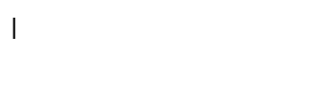

# Vue Auto Typing

Vuejs component for auto typing your text.

[![npm version][0]][1]



# Table of contents

* [Installation](#installation)
* [Usage](#usage)
* [Support](#support)
* [Contributing](#contributing)
* [License](#license)
* [Bonus](#buy-me-a-coffee)

# Installation

## NPM

```npm
npm i daniel-ordonez@vue-auto-typing
```

Register the component inside your Vue file

```javascript
// Insde the <script> of your .vue file
import AutoTyping from 'VueAutoTyping'
export default{
 components:{
  AutoTyping
 }
}
```

## Client side

Add Vue and VueAutoTyping scripts
```html
<script src="https://unpkg.com/vue"></script>
<script src="./VueAutoTyping.umd.js"></script>
<link rel="stylesheet" href="./VueAutoTyping.css">
```

Register the auto-typing component

```javascript
new Vue({
  components: {
    autoTyping: VueAutoTyping
  }
}).$mount('#app')
```

### VueAutoTyping.css

The stylesheet contains only the necessary css for displaying the blinking cursor and it's completely optional, just be aware that if not included the cursor won't show unless you provide your own css.

``` css
.auto-typing--cursor::after{
    content: attr(data-cursor);
    display: inline;
    -webkit-animation: cursor-blink 0.7s infinite;
    -moz-animation: cursor-blink 0.7s infinite;
    animation: cursor-blink 0.7s infinite;
}
@keyframes cursor-blink {
    from{
        opacity: 1;
    }
    50%{
        opacity: 0;
    }
    to{
        opacity: 1;
    }
}
```


# Usage

```html
 <auto-typing>My text</auto-typing>
```

## Props
| Name     | Type    | Default   | Description |
|----------|---------|-----------|-------------|
|auto      |Boolean  |true       |If false, need to call **start()** to start the typing.
|delay     |Number   |0          |Time in ms after the component is mounted and before start typing|
|speed     |Number   |250        |Time in ms before typing the next character|
|variance  |Number   |50         |Time in ms it can varies between typing the next character|
|mode      |String   |"human"    |If **human**, the time between each character is _speed + (variance * random)_. If **linear** the time between each character is equals to _speed_|
|split     |Boolean  |false       |If true, each character is wrapped around an individual _span_ tag|
|readtime  |Number   |1000       |The time in ms before start typing the next string. See [typing multiple strings](#typing-multiple-strings)|
|cursor    |String   |&#124;     |The cursor displayed when typing at the end|
|keepCursor|Boolean  |false      |if false the cursor is hidden when then typing ends, otherwise it keeps blinking at the end of the text|

## Typing multiple strings

A few considerations first regarding the text inserted between the component tags:
* It always be written first
* If nothing is inside the tags when the component mounts nothing will be written, unless you add it by the **push** function.

Think of **push()** the same as with Arrays
```html
<auto-typing>This is first</auto-typing>
```
```javascript
//assume the var autoTyping references your component's object
autoTyping.push("This is second");
autoTyping.push("This is third");
```


## Customize

* Clone this repository
* Make changes to src/components/VueAutoTyping.vue
* From source directory execute: `npm run build-lib`

# Support

Please [open an issue](https://github.com/daniel-ordonez/vue-chatui/issuess/new) for support.

>Be aware that some features may be under development

# Contributing

1. Please check whether another person has raised a pull request for same issue before creating one.
2. Please check issues created before requesting for a feature.
3. Open a pull request explaining what changes it brings.
4. Add references where applicable.

# License

[MIT license](https://tldrlegal.com/license/mit-license)

# Buy me a coffee

<a href="https://www.buymeacoffee.com/danielordonez" target="_blank"></a>

Yay! 🎉 You reached the end.

[0]: https://img.shields.io/badge/npm-0.1.1-lightgrey.svg
[1]: https://www.npmjs.com/package/@daniel-ordonez/vue-auto-typing